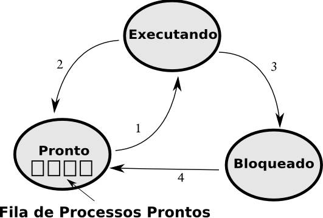

<h1 align="center"> Sistemas Operacionais </h1> 

Este é uma documentação que resume o que entendo pela área de Sistemas Operacionais.

## Autor

Sou Fernando Gabriel M. da Silva, atualmente estudante de computação pela UFCG.

## Sumário

<ol>
    <li> Processos </li>
    <li> Introdução à probabilidade.</li>
        <ul>
            <li>2.1. Conceitos iniciais </li>
            <li>2.2. Teoria das probabilidades: Abordagem clássica. </li>
            <li>2.2. Teoria das probabilidades: Abordagem axiomática. </li>
            <li>2.2. Teoria das probabilidades: Probabilidade condicional. </li>
        </ul>
</ol>

## Referências

* Modern Operating Systems, ANDREW S. TANENBAUM.

##  Sistema operacional

### O que é sistema operacional

O sistema operacional é um software, ou conjunto de softwares, cuja função é administrar e gerenciar os recursos de um sistema, desde componentes de hardware e sistemas de arquivos a programas de terceiros, estabelecendo a interface entre o computador e o usuário.

### Funções de um sistema operacional

O sistema operacional tem como uma de suas funções prover para os programas do usuário abstrações, por meios de processos, sistemas de arquivos, etc. Além disso, o sistema operacional é responsável por gerenciar os recursos da máquina e controlar os periféricos. Por fim, um computador pode conter muitas informações que os usuários querem proteger ou manter confidêncial. Portanto, um das funções do sistema operacional é gerenciar o sistema de segurança para que esses arquivos, por exemplo, sejam acessíveis apenas para alguns usuários autorizados.

### Macanismos básicos do sistema operacional

**System Call**: As system calls são chamadas síncronas ao sistema feitas pelos programas que solicitam um serviço do kernel (como acesso ao hardware ou criação de novos processos por exemplo), portanto, são situações "esperadas" e previsíveis.

**Exceções (Traps)**:  A excução de uma chamada ao sistema gera uma exceção no modo kernel, ou seja, ela será tratada pelo próprio sistema operacional e, através de uma tabela pre determinada, o SO determina qual será a rotina a ser executada.

**Interrupções**: As interrupções são causadas pelo próprio hardware e são assícronos. No sentido que não são sincronizadas com a execução do código das aplicações e do kernel. Geralmente são vinculadas aos eventos de I/O ou do clock. São importantes pois, como o exemplo do clock, ajudam o escalonador a realizar a troca de contexto.

## Processos e Threads

### Modelo do processo

 Processos são estrutura de dados que representam instâncias de programas em execução, incluindo nisso valores atuais de registradores, contadores , variáveis e e os recursos utilizados (arquivos abertos, processos relacionados ...). Embora o usuário tenha a ideia de um parelismo, na realidade, a CPU (com 1 núcleo) vai e volta de processo em processo através de uma algoritmo escalonador de processos que decide quando parar e quando começar outro processo . Essa rápida troca é chamada de multiprogramação. 

**Multiprogramação**: Multiprogramação (ou time-sharing) é o chaveamento entre a execução de vários processos criando a ilusão de uma execução em paralelo.


### Criação de Processo e  Hierarquia de Processo

Todos os processos instanciados são filhos de um processo pai e existe um processo que é inicializado ao realizar o carregamento do Sistema Operacional. No linux, esse processo é chamado de systemd.Um PID é um identificador único para um processo. Na família de SO UNIX existe uma operação chamada fork. Essa operação clona o processo em dois. O resultado do fork no filho retorna 0 e no pai retorna o PID do filho.
imagem de fork

### Estados do processo

<center>
    
</center>
<br/>
Existem três principais estados para um processo: Bloqueado, Rodando e Pronto para Rodar. Segue um exemplo abaixo de troca de contexto.
<br/>
<ol>
    <li>
    Através da exceção ou interrupção, no caso onde um processo que está em estado de "pronto" e aguardando CPU,  é escolhido (escalonado), esse processo passa a ocupar a CPU dado que a fatia de tempo destinada ao processo que estava em estado de "executando" acabou.
    </li>
    <li>
     Essa transição ocorre em consequência de uma interrupção de hardware. Um dispositivo requer atenção. O relógio de hardware gera uma interrupção para indicar que a fatia de tempo destinada ao processo acabou.
    </li>
    <li>
        Essa transição ocorre, devido a uma exceção, quando um processo de usuário solicita algo ao sistema operacional através de um system call. Por exemplo  um programa que espera a entrada do teclado, sendo então necessário esperar para receber essa entrada.
    </li>
    <li>
        Essa transição corre através da exceção ou interrupção em que a solicitação de um processo que estava em estado de "bloqueado" é atendida pelo SO. O processo irá ocupar um posição na fila de prontos onde será em seguida escolhida pelo escalonador.
    </li>
</ol>

### Escalonamento

Troca de contexto é quando um processo é retirado de execução para que outro seja executado. Escalonador é responsável por realizar a troca de contexto entre os processos em execução.
(como faz isso? algoritmos)

### Comunicação entre Processos

#### Condição de corrida

É uma situação onde os eventos que ocorrem podem influenciar na execução de processos, especialmente quando existem vários fluxos de execução "simultâneos", e também soluções para esse problema.

Para entender possíveis problemas que podem acontecer com vários processos operando sobre uma mesma Área de Memória Compartilhada, imagine a seguinte situação: um usuário possui uma conta no banco que tem R$ 1.000,00. Ele deseja fazer uma compra de R$ 100,00 com seu cartão de débito e, ao mesmo tempo, ele recebe seu pagamento mensal de R$ 3.500,00. Neste caso, existirão dois processos concorrentes, um que vai retirar 100 reais de sua conta, e outro que vai adicionar 3500.

Como o sistema operacional do banco implementa o pseudo-paralelismo, ele tem que realizar o chaveamento de processos. Imagina que o primeiro processo faz a diferença, verifica que o novo saldo é de 900 reais, e no instante em que ele vai fazer a atualização desse valor, a CPU o interrompe e faz o chaveamento para o outro processo que adiciona 3500 reais em sua conta. Para esse outro processo, o valor ainda é 1000, então quando fizer a soma, vai ficar 4500 reais na conta do usuário. Porém, quando esse segundo processo parar de executar, e o anterior ganhar a CPU novamente, ele não terá a informação da atualização do e vai salvar como 900 reais.

Ou seja, o saldo final desse usuário ficará R$ 900,00. Isso dá a impressão que o sistema "ignorou" o pagamento recebido pelo usuário, já imaginou a confusão que isso causaria?

Quando acontece?
Para existir uma condição de corrida, é necessário que vários fluxos de execução (processos ou threads) operem sobre tais recursos compartilhados e, quando um desses fluxos vai executar pressupondo um estado inicial dos recursos, algo acontece entre a obtenção de tal estado, alterando-o, e a execução final.

É importante ter em mente que a condição de corrida não é um erro, e sim inerente a alguns problemas, e não há como fugir. O possível erro ocasionado por uma condição de corrida só ocorre se não for devidamente tratado.


#### Região critica

A região crítica de um determinado processo é a parte de seu código que acessa a Área de Memória Compartilhada, que, como o próprio nome sugere, é um conjunto de recursos que podem ser compartilhados entre dois ou mais processos, por exemplo, memória, variáveis, arquivos, etc. Essa área depende expressivamente que a parte do processo que a acessa tenha sua execução de forma sequencial, e esse é um dos principais fatores que influenciam para a ocorrência de uma condição de corrida.

#### Exclusão mútua

Soluções para condições de corrida
Para evitar que erros aconteçam devido a vários fluxos de execução operando sobre uma mesma área de memória compartilhada, devemos garantir:

A exclusão mútua, que é a certeza de que, caso exista um processo executando sua região crítica, nenhum outro processo vai poder executar a sua até que o primeiro termine sua execução.
A não existência de hipótese sobre a velocidade da CPU. Por exemplo, implementar uma solução que só é possível de funcionar caso a velocidade da CPU na qual estão sendo executados os processos seja X.
Que nenhum fluxo deve ser impedido de entrar na região crítica, caso outro fluxo não esteja utilizando a sua.
Que não exista starvation, ou seja, que um processo morra porque não ganhou a CPU em nenhum momento.

#### Mutexes

### Espera ocupada (busy wait)

Uma solução baseada em espera ocupada consiste em: o fluxo de execução, antes de entrar na região crítica, precisa passar por uma verificação para saber se ele pode ou não entrar lá. Caso não possa e já exista outro processo executando sua região crítica, ele fica em loop até que ele possa ganhar essa região.

Um dos exemplos mais conhecidos de solução para condição de corrida que implementa a espera ocupada é a Solução de Peterson ou Algoritmo de Peterson. O código abaixo exemplifica como essa solução pode ser implementada para resolver esse problema com dois fluxos alternativos de execução:

```
// suponha que existam dois processos, i = 0 e j = 1

int vez = 0; // indica de quem é a vez
bool interessado[2]; // array que indica quem está interessado em acessar a região crítica

// Código de entrada na região crítica
void entraNaRegiaoCritica(int processo) {
  int other = 1 - processo; // representa o outro processo
  vez = processo;
  interessado[processo] = true;
  while(vez == processo && interessado[other] == true); // fica em loop, caso não possa entrar
}

// Código para saída da região crítica
void saiDaRegiaoCritica(int processo) {
  interessado[processo] = false; // indica que o processo que estava na região crítica terminou sua atividade.
}

// Código que exemplifica o 'main' em um dos fluxos de execução
int main() {
  int ID = 1;

  entraNaRegiaoCritica(ID);
  acessaArquivoCompartilhado(); // código de acesso à região crítica.
  saiDaRegiaoCritica(ID);

  return 0;
}
```
### Semáforos

É uma variável utilizada para controlar acesso a recursos compartilhados

semaforo = 0 não há recuso livre
semaforo > 0 recurso livre


wait 

verifica sre o valor do semaforo é maior que 0

se for, semafodo = semaforo -1, executa 
se for 0, o processo que executou o wait é colocado para dormir, sem completar o wait

signal 

semaforo = semaforo +1

se há processos dormindog nesse semaforo escolhe um deles e o desbloqueia ()
nesse cado o valor do semaforo permanece o mesmo,


### DeadLocks

Segundo Tanenbaum, deadlock pode ser definido como: “Um conjunto de processos estará em situação de deadlock se todo processo pertencente ao conjunto estiver esperando por um evento que somente um outro processo desse mesmo conjunto poderá fazer acontecer”.

De uma forma mais simples, para melhor entendimento, podemos dizer que deadlock é um termo empregado para traduzir um problema ocorrido quando um grupo de processos competem entre si. A ocorrência do deadlock depende das características de dois ou mais programas diferentes e dos respectivos processos a executar pelos diferentes programas ao mesmo tempo. Pode ser, que esses processos possam ser executados de forma repetitiva usando diferentes processos sem que ocorra deadlock, todavia, basta um único processo padrão complicado para entrar em situação de deadlock.

Mesmo não relacionado a computação, podemos citar um exemplo de situação de deadlock que facilita o entendimento do que seja uma situação de deadlock. Dois carros estão seguindo em direções opostas, um de encontro ao outro, em uma pista que permite apenas a passagem de um veículo. Nesse caso os dois ficam impedidos de continuar seu percurso.

Existem quatro condições para a ocorrência de deadlock:

Condição de exclusão mútua. Em um determinado instante, cada recurso está em uma de duas situações: ou associado a um único processo ou disponível.
Condição de posso e espera. Processos que, em um determinado instante, retêm recursos concedidos anteriormente podem requisitar novos recursos.
Condição de não preempção. Recursos concedidos previamente a um processo não podem ser tomados a força desse processo, eles devem ser explicitamente liberados pelo processo que os retém.
Condição de espera circular. Deve existir u encadeamento circular de dois ou mais processos; cada um deles encontra-se à espera de um recurso que está sendo usado pelo membro seguinte dessa cadeia.


