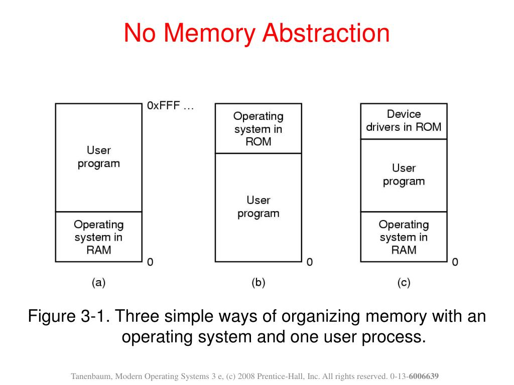
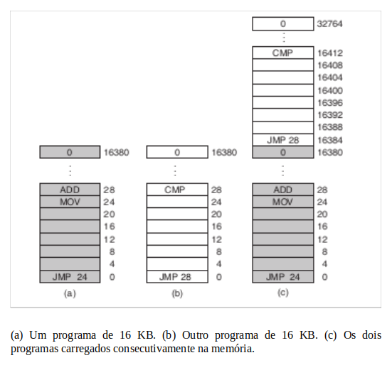

<h1 align="center">3. Gerenciamento de mémoria</h1>

## 3.1 Sem abstração de memória.

Nas primeiras décadas da área computacional os computadores disponham de pouca memória e podendo apenas um programa executar de cada vez sem que impactar a memória utilizada por outro programa. Quando um programa era executado uma instrução como essa era usada.

MOV REGISTER1, 1000

 

O computador apenas moveu o que tinha na memória física na posição 1000 para o registrador 1. Esse tipo de modelo de memória permitia que os programas apenas enxergassem um conjunto de endereços de memória de 0 até uma máximo possuído, com células de memória com 8 bits cada. 

Para sanar essa dificuldade, algumas opções foram consideradas nas décadas passadas. Por exemplo, como mostra a figura abaixo, a opção **a)** colocamos todo o sistema operacional no fim da memória RAM e deixar o resto para os programas executarem; ou na opção **b)** onde temos um sistema operacional alocado em uma memória não volátil e deixar o resto da memória RAM para os programas executarem; ou opção **c)** onde deixamos drives de dispositivos em uma memória não volátil (BIOS) enquanto o sistema operacional é carregado no final da memória RAM deixando o resto para os programas executarem.

 

 

Entretanto há conclusões que podemos tomar observando bem essas opeções do passao. Embora a opção b) seja usada em sistemas embarcados até os dias atuais, as opções a) e c) tem um bug. O fato é que, como o sistema operacional está carregado na mémoria RAM, os programas que usuário executa podem sobrescrever parte dessa mémoria destinada ao sistema operacional, causando profundos danos ao sistema.

Por fim, isso levou a área de estudos onde estudamos melhores maneiras de manusear a mémoria RAM.

## 3.2 Abstração de mémoria: espaços de endereços

Alguns problemas podemos tirar do tipo de abordagem de memória física. Primeiro, como falado no tópico anterior, para programas que exergam apenas a memória física (RAM) é difícil não colidirem por acidente com o sistema operacional. Segundo, com essa abordagem é difícil também ter multíplos programas rodando compartilhando os recursos da CPU. Hoje em dia é comum um computador ter vários programas rodando na memória, em um mundo onde não existe abstração para a memória física é muito difícil tornar isso realidade.

 

### 3.2.1 Noção de espaço de endereçamento

Os dois problemas mencionados devem ser resolvida para que seja possível a execução de várias aplicações ao mesmo tempo sem que interfiram uma na outra, ou seja, **proteção** e **realocação** são as palavras chaves.

Para isso surge uma nova abstração para memória: **espaço de endereçamento** (address space). Cada processo agora tem seu próprio espaço de endereçamento que é, por sua vez, formado por um conjunto de **endereços de memória** da qual o processo pode manusear a vontade.

**registradores de base e limit** 

A solução clássica para que cada programa tenha seu próprio espaço de endereçamente veio através da adição de dois registradores à CPU: **base** e **limit**. Quando os registradores são utilizados, os programas são carregados em espaçoes consecutivos de memória. Então, quando um processo roda é armazenado registrador base o endereço físico onde o programa começa e no registrador limit é armazenado o tamanho do programa.

Por exemplo, na figura **c)** quando o primeiro programa roda o seu registrador base vai ser o 0 e como ele consume 16384 Bytes sendo esse o seu limit.   

A desvantagem da realocação usando registradores base e limit é a necessidade realizar uma adição e comparação para cara referência de memória. Comparações podem ser rápidas, mas adições são lentas devido ao tempo de propagação para a alocação.

### 3.2.2 Swapping

### 3.2.3 Manuseando memória livre
## 3.2 Memória virtual
### 3.2.1 Paginação
### 3.2.2 Page tables
## 3.3 Algoritmos de paginação
### 3.3.4 Pagle Tables for large memories