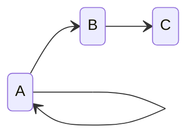
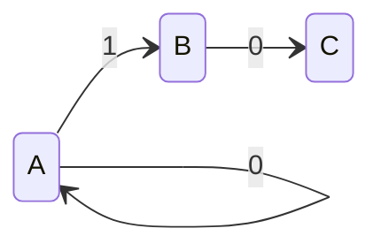
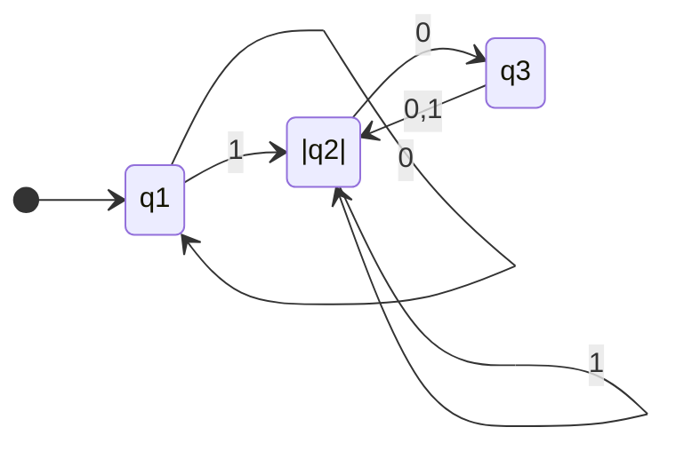
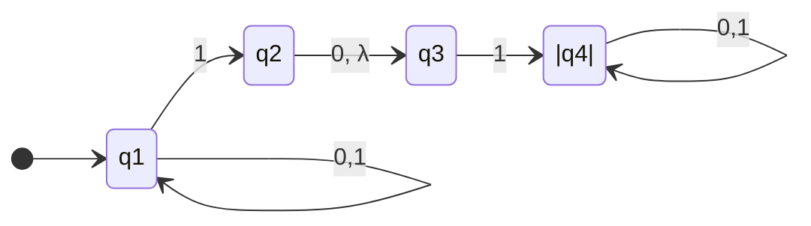
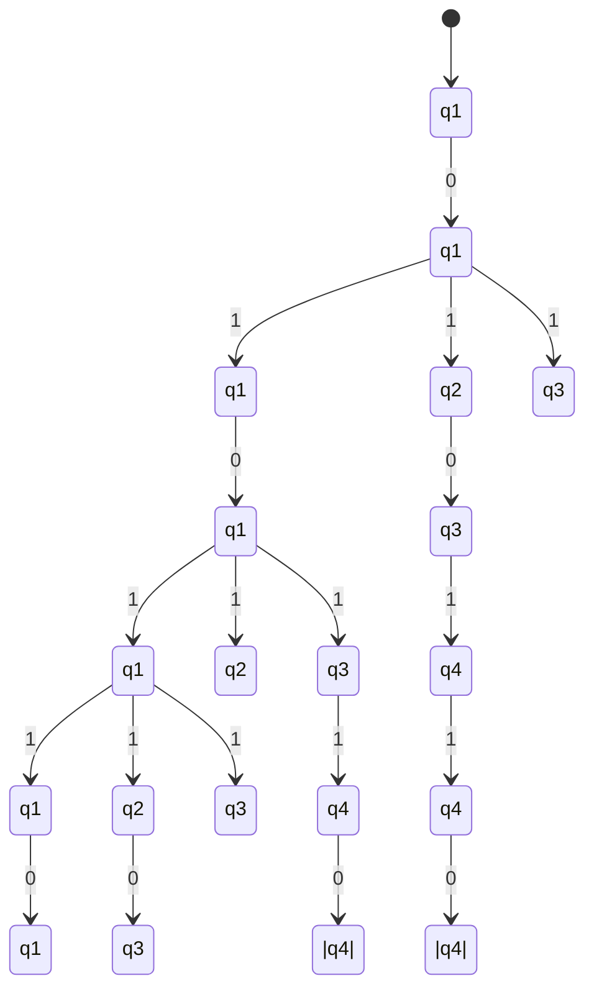
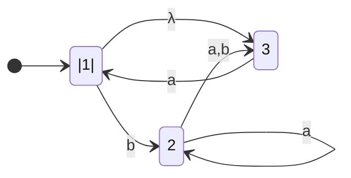
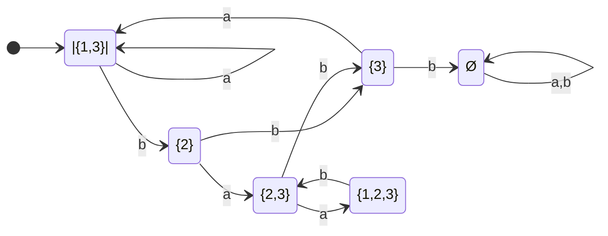

<h1 align="center"> Linguagens regulares </h1> 

## 1.1 Sobre Autômatos Finitos

### 1.1.1 Conceitos inicias:
 

#### **Alfabeto ( $\Sigma$ )**: Um alfabeto é um conjunto finito de símbolos.
Exemplos:
* Alfabeto latino;
* Unicode;
* {0,1};
* {a,b,c};

 

#### **String ( $\Sigma^*$ )**: Cada strig de um determinado alfabeto é uma sequência de elementos do alfabeto.
Exemplos:
* {0,1}* = { $\lambda$ , 0, 1, 00, 11, 01, 10, 000, 001, ...};
* {a,b,c} ={ $\lambda$ , a, b, c, ab, ac, ba, bc, cb, ...};

 

#### **Linguagem ( $L_*$ )**: A linguagem é um subconjunto de $\Sigma^*$.
Exemplos:
* Supondo um $\Sigma$ = {0, 1}. A linguagem $L_1$ cujas as strings não possuem dois 1's consecutivos. 
$L_1$ = { $\lambda$ , 0, 1, 00, 01, 10, 000, 001, 010, 100, 101, 0000, ... }

 

#### **Estados (Qualquer notação)**: Os estados de um autômato são a representação dos modos que um determinado problema pode está.
Exemplo:

Os estados seriam {A,B,C}.

 

#### **Função de transição ( $\delta$ )**: As funções de transição são as setas que indicam a passagem de um estado para outro.
Exemplo:

As funções de transição seriam { $\delta$ (A, 0) = A, $\delta$ (A, 1) = B, $\delta$ (B, 0) = C}.

 

### 1.1.2 Definição Formal de um Autômato Finito.
 

Primeiro, uma definição formal é precisa... (pagina 35 do livro texto)

Um autômato finito é definido através:

* Dos estados em que ele pode estar durante uma computação
*  Dos símbolos que podem ser usados para escrever as palavras de entrada
(conjunto dos símbolos → alfabeto)
*  Das regras que descrevem como ele muda de estado para cada símbolo
(transições)
*  Do estado inicial
*  Da lista dos estados que são considerados finais

Formalmente, um AF M é uma 5-tupla <Q, $\Sigma$, $\delta$ , q0, F>, onde:

* Q é um conjunto finito e não-vazio chamado de **conjunto de estados**
* $\Sigma$ é um conjunto finito e não-vazio chamado de **alfabeto**
* δ : Q X $\Sigma$ $\rightarrow$ Q é a função (total) de **transição** do autômato
* q0 $\epsilon$ Q é o **estado inicial**
* F  $\subseteq$ Q é o conjunto de **estados finais**

Exemplo: Monte um diagrama de estados que segue essa especificação:

* 3 estados: {q1, q2, q3}
* Estado inicial: q1
* Estados finais (F): q2
* Alfabeto: {0,1}
* Função de transição (regras):  
  * $\delta$(q1, 0) = q1,
  * $\delta$(q1, 1) = q2,
  * $\delta$(q2, 0) = q3,
  * $\delta$(q2, 1) = q2,
  * $\delta$(q3, 0) = q2,
  * $\delta$(q3, 1) = q2.   

 

## 1.2. As Operações Regulares.

Em aritmética, os objetos básicos são npumeros e as ferramentas são operações para manipulá-los , tais como + e x. Na teoria da computação os objetos são linguagens e as ferramentas incluem operações especificamente projetadas para manipulá-las. Definimos três operações sobre linguagens, chamadas **operações regulares**, e as usamos para estuar propriedades de linguagens regulares. Sejam A e B linguagens, definimos operações dessa forma:

* União:  $A \cup B$  =  { $x$ $\epsilon$ $A$ ou $x$ $\epsilon$ $B $} 
* Concatenação: $A \bullet B$  = { $xy$ | $x$  $\epsilon$ $A$ e $y$ $\epsilon$ $B$} 
* Estrela: $A^*$ = { $x_1x_ 2 x_ 3...x_ k$ | k $\ge$ 0 e cada $x_i$ $\epsilon$ A}
* Interseção: =  $A \cap B$  = { $x$ $\epsilon$ $A$ e $x$ $\epsilon$ $B $}
* Complemento: $\bar A$ = {}

Exemplo 1: Suponha um alfabetgo $\Sigma$ seja o alfabeto padrão de 26 letras {a,b,c,...,z}. Se A = {legal, ruim} e B = {garoto, garota}, então:

* $A \cup B$ = {legal, ruim, garoto, garota}
* A $\bullet$ B = {legalgaroto, legalgarota, ruimgaroto, ruimgarota}
* $A^*$ = { $\lambda$, legal, ruim, legallegal, legalruim, ruimlegal, ruimruim, legallegallegal, ...}

Exemplo 2: 

(Ainda a melhorar)

## 1.3. Autômatos Finitos Não determinístico (AFN) 
  

### 1.3.1 O que é um AFN.

Quando a máquina está em um dado estado e lê o próximos símbolo de entrada, sabemos qual será o próximo estados-está determinado. Chamamos isso de computação **determinística**. Em uma máquina **Não-determinística**, várias escolhas podem existir para o próximos estado em qualquer ponto.

O não-determinismo é uma generalização de determinismo; portanto, todo autômato finito determinístico é automaticamente um autômato finito não determinístico. Como a Figura abaixo mostra, autômatos finitos não-determinísticos podem ter características adicionais.

 

A diferença entre um autômato finito determinístico (AFD), e um autômato finito não-determinístico (AFN), é imediatamente aparente. Primeiro, todo estado de um ADF sempre tem exatamente uma seta de transição saindo de cada símbolo do alfabeto. O AFN monstrado no diagrama anterior viola essa regra. O estado $q_1$ tem uma seta saindo do 0, mas tem duas para 1; $q_2$ tem uma seta para 0, mas nenhuma para 1. Em um AFN pode ter estado zero, uma  ou várias setas saindo para cada símbolo do alfabeto.

Segundo, em um AFD, os rótulos sobre as setas de transição são simbolos dos alfabeto. Esse ADN tem ua seta com o rótulo $\lambda$. EM geral, um AFN pode ter setas rotuladas com membros do alfabeto ou com $\lambda$. Zero, uma ou mais setas podem sair de cada estado com o rótulo $\lambda$.

 

### 1.3.2 Como um AFN computa?

Suponha que você esteja rodando um AFN sobre uma cadeia de entrada e venha para um estado com múltiplas maneiras de prosseguir. (pagina 49)

Exemplo: Vamos considerar a figura da secção 1.2.1. A computação do AFN sobre uma entrada 010110 é exemplificada abaixo.

### 1.3.3 Definição formal de autômato não-determinístico

A definição formal de um autômato finito não-determinístico é similar àquela de um autômato finito determinístico. Ambos têm estados, um alfabeto de entrada, uma função de transição, um estado inicial e uma coleção de estados de aceitação. Entretando, eles diferem de uma maneira essencial: no tipo de função de transição. Em um AFD a função de transição toma um estado e um símbolo de entrada e produz o próximo estado. Em um AFN a função de transição toma um estado e um símbolo de entrada _ou uma cadeia vazia_ e produz _o conjunto de próximos estados possíveis_.

Formalmente, um AFN é uma 5-tupla <Q, $\Sigma$, $\delta$ , q0, F>, onde:

* Q é um conjunto finito de **estados**
* $\Sigma$ é um ***alfabeto finito**
* δ : Q X $\Sigma_\epsilon$ $\rightarrow$ P(Q) é a função e **transição** do autômato.
* q0 $\epsilon$ Q é o **estado inicial**
* F  $\subseteq$ Q é o conjunto de **estados finais**

 

### 1.3.4 Equivalência de AFN's e AFD's

Os autômatos finitos determinísticos e não-determinístico reconhecem a mesma classe de linguagens. Essa equivalência é, ao mesmo tempo, supreendente e útil. É supreendente porque AFN's parecem ter mais poder que AFD's e, portanto, poderíamos esperar que AFN's reconhecessem mais linguagens. É util porque descrever um AFN para uma dada linguagem às vezes é muitos mais fácil que descrever um AFD para essa linguagem.

**Teorema**: Todo autômato finito não-determinístico tem um  autômato finito determinístico equivalente.

**Corolário**: Uma linguagem é regular se e somente se algum  autômato finito não-determinístico a reconhece.

Exemplo: Vamos ilustrar o procedimento para transformar um AFN em AFD usando uma máquina $N_1$ abaixo. Sendo $N_1$ = (Q, {a,b}, $\delta$, 1, {1}), então temos:

Para construir um AFD $D_1$ que seja equivalente a $N_1$ devemos primeiro determinar os estados de D mapeando as transições. Sabendo que o estado 1 tem uma transição lambda para 3 então para o método rápido levamos em consideração o estado {1,3} primeiro.

|Estados | a | b |
|---|---|---|
1, 3| 1 |2 |
2 | 2,3 | 3 |
3 | 1 | $\oslash$ |
2,3 | 1,2,3 | 3 |
1,2,3 | 1,2,3 | 2,3 |

### 1.3.5 Fecho sob as operações regulares

**Teorema**: A classe de linguagens regulares é fechada sob operação de união.

**Teorema**: A classe de linguagens regulares é fechada sob operação de concatenação.

**Teorema**: A classe de linguagens regulares é fechada sob operação de estrela.

Explicações pagina 60

## 1.4 Expressões Regulares

### 1.4.1 Definição 

Seja $\Sigma$ um alfabeto, então:
* Se a $ \epsilon$ $\Sigma$, então a é uma **expressão regular**
* Se $\lambda$ é a palavra nula, então $\lambda$ é uma **expressão regular**
* Se $\oslash$ é o conjunto vazio, então $\oslash$ é uma **expressão regular**
* Se R1 e R2 são expressões regulares, então(R1 $\cup$ R2) e (R1 • R2) são expressões regulares
* Se R1 é uma expressão regular, então ($R1^*$) é uma **expressão regular**.

$\lambda$ versus $\oslash$:
* $\lambda$: antes representava uma palavra, a palavra vazia, mas aqui, como ER, é a ER que tem como linguagem um conjunto unitário, cujo único elemento é a palavra vazia.
* $\oslash$: aqui, como ER, representa um conjunto vazio, então não tem nenhuma palavra.

## Linguagens Não-regulares
