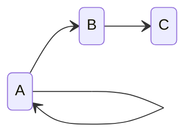
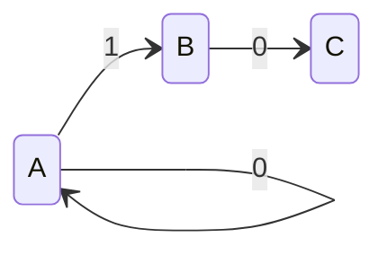
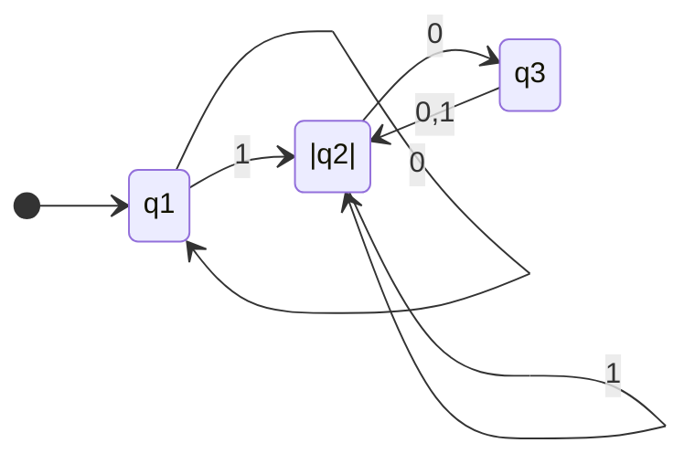
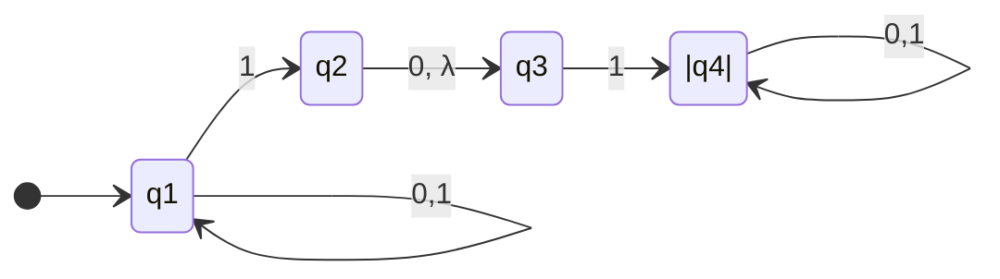

<h1 align="center"> Autômatos e Linguagens </h1> 

## 1.1 Autômatos Finitos

 

### 1.1.1 Conceitos inicias:

#### **Alfabeto ($\Sigma$)**: Um alfabeto é um conjunto finito de símbolos.
Exemplos:
* Alfabeto latino;
* Unicode;
* {0,1};
* {a,b,c};

 

#### **String ($\Sigma^*$)**: Cada strig de um determinado alfabeto é uma sequência de elementos do alfabeto.
Exemplos:
* {0,1}* = {$\lambda$, 0, 1, 00, 11, 01, 10, 000, 001, ...};
* {a,b,c} ={$\lambda$, a, b, c, ab, ac, ba, bc, cb, ...};

 

#### **Linguagem ($L_*)$**: A linguagem é um subconjunto de $\Sigma^*$.
Exemplos:
* Supondo um $\Sigma$ = {0, 1}. A linguagem $L_1$ cujas as strings não possuem dois 1's consecutivos. 
$L_1$ = {$\lambda$, 0, 1, 00, 01, 10, 000, 001, 010, 100, 101, 0000, ... }

 

#### **Estados (Qualquer notação)**: Os estados de um autômato são a representação dos modos que um determinado problema pode está.
Exemplo:

Os estados seriam {A,B,C}.

 

#### **Função de transição ($\delta$)**: As funções de transição são as setas que indicam a passagem de um estado para outro.
Exemplo:

As funções de transição seriam {$\delta$(A, 0) = A, $\delta$(A, 1) = B, $\delta$(B, 0) = C}.

 

### 1.1.2 Definição Formal de um Autômato Finito.
 

Primeiro, uma definição formal é precisa... (pagina 35 do livro texto)

Um autômato finito é definido através:

* Dos estados em que ele pode estar durante uma computação
*  Dos símbolos que podem ser usados para escrever as palavras de entrada
(conjunto dos símbolos → alfabeto)
*  Das regras que descrevem como ele muda de estado para cada símbolo
(transições)
*  Do estado inicial
*  Da lista dos estados que são considerados finais

Formalmente, um AF M é uma 5-tupla <Q, $\Sigma$, $\delta$, q0, F>, onde:

* Q é um conjunto finito e não-vazio chamado de **conjunto de estados**
* $\Sigma$ é um conjunto finito e não-vazio chamado de **alfabeto**
* δ : Q X $\Sigma$ $\rightarrow$ Q é a função (total) de **transição** do autômato
* q0 $\epsilon$ Q é o **estado inicial**
* F  $\subseteq$ Q é o conjunto de **estados finais**

Exemplo: Monte um diagrama de estados que segue essa especificação:

* 3 estados: {q1, q2, q3}
* Estado inicial: q1
* Estados finais (F): q2
* Alfabeto: {0,1}
* Função de transição (regras):  
  * $\delta$(q1, 0) = q1,
  * $\delta$(q1, 1) = q2,
  * $\delta$(q2, 0) = q3,
  * $\delta$(q2, 1) = q2,
  * $\delta$(q3, 0) = q2,
  * $\delta$(q3, 1) = q2.   

 

## 1.2. As Operações Regulares.

Em aritmética, os objetos básicos são npumeros e as ferramentas são operações para manipulá-los , tais como + e x. Na teoria da computação os objetos são linguagens e as ferramentas incluem operações especificamente projetadas para manipulá-las. Definimos três operações sobre linguagens, chamadas **operações regulares**, e as usamos para estuar propriedades de linguagens regulares. Sejam A e B linguagens, definimos operações dessa forma:

* União:  $A \cup B$  =  { $x$ $ \epsilon$ $A$ ou $x$ $\epsilon$ $B $} 
* Concatenação: $A \bullet B$  = { $xy$ | $x$  $\epsilon$ $A$ e $y$ $\epsilon$ $B$} 
* Estrela: $A^*$ = { $x_1x_ 2 x_ 3...x_ k$ | k $\ge$ 0 e cada $x_i$ $\epsilon$ A}
* Interseção: = { $x$ $ \epsilon$ $A$ e $x$ $\epsilon$ $B $}
* Complemento: $\bar A$ = {}

Exemplo 1: Suponha um alfabetgo $\Sigma$ seja o alfabeto padrão de 26 letras {a,b,c,...,z}. Se A = {legal, ruim} e B = {garoto, garota}, então:

* A $ \cup $ B = {legal, ruim, garoto, garota}
* A $\bullet$ B = {legalgaroto, legalgarota, ruimgaroto, ruimgarota}
* $A^*$ = {$\lambda$, legal, ruim, legallegal, legalruim, ruimlegal, ruimruim, legallegallegal, ...}

Exemplo 2: 

(Ainda a melhorar)

## 1.2. Autômatos Finitos Não determinístico (AFN) 
  

### 1.2.1 O que é um AFN.

Quando a máquina está em um dado estado e lê o próximos símbolo de entrada, sabemos qual será o próximo estados-está determinado. Chamamos isso de computação **determinística**. Em uma máquina **Não-determinística**, várias escolhas podem existir para o próximos estado em qualquer ponto.

O não-determinismo é uma generalização de determinismo; portanto, todo autômato finito determinístico é automaticamente um autômato finito não determinístico. Como a Figura abaixo mostra, autômatos finitos não-determinísticos podem ter características adicionais.

 

A diferença entre um autômato finito determinístico (AFD), e um autômato finito não-determinístico (AFN), é imediatamente aparente. Primeiro, todo estado de um ADF sempre tem exatamente uma seta de transição saindo de cada símbolo do alfabeto. O AFN monstrado no diagrama anterior viola essa regra. O estado $q_1$ tem uma seta saindo do 0, mas tem duas para 1; $q_2$ tem uma seta para 0, mas nenhuma para 1. Em um AFN pode ter estado zero, uma  ou várias setas saindo para cada símbolo do alfabeto.

Segundo, em um AFD, os rótulos sobre as setas de transição são simbolos dos alfabeto. Esse ADN tem ua seta com o rótulo $\lambda$. EM geral, um AFN pode ter setas rotuladas com membros do alfabeto ou com $\lambda$. Zero, uma ou mais setas podem sair de cada estado com o rótulo $\lambda$.

 

### 1.2.2 Como um AFN computa?